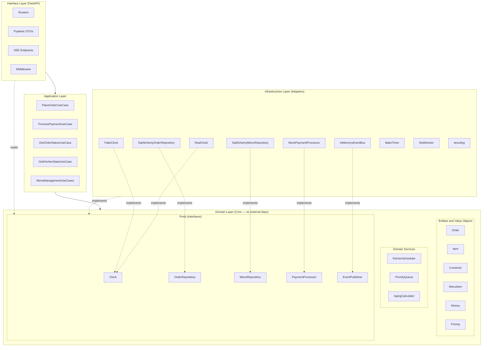

# Architecture Diagram

The four layers of the system, the direction of dependencies, and the ports/adapters relationship.

## The Dependency Rule

Dependencies always point inward toward the domain:

- The **Interface** layer depends on **Application** and on **Domain contracts (Ports)**
- The **Application** layer depends on **Domain**
- The **Infrastructure** layer depends on **Domain** (it implements the ports)
- The **Domain** layer depends on **nothing external**

This means the domain can be tested, refactored, or reused without touching infrastructure or interface concerns. The same domain code would work with a different web framework or a different database.

## Why Ports and Adapters

The ports (interfaces in the domain) define **what** the domain needs. The adapters (implementations in infrastructure) define **how** those needs are met. This separation enables:

- Substituting `FakeClock` for `RealClock` in tests without touching domain code
- Swapping `MockPaymentProcessor` for a real Stripe integration without changes outside infrastructure
- Replacing PostgreSQL with another database by writing new repository adapters
