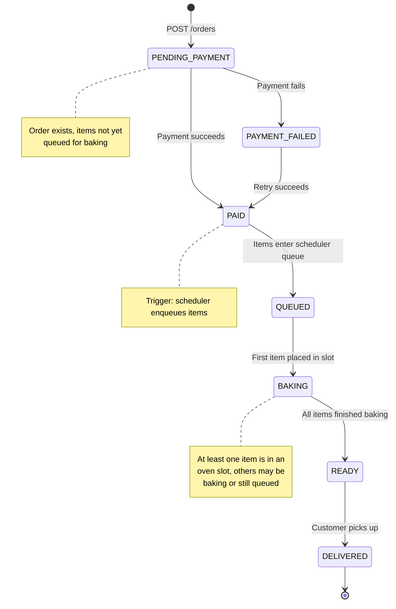
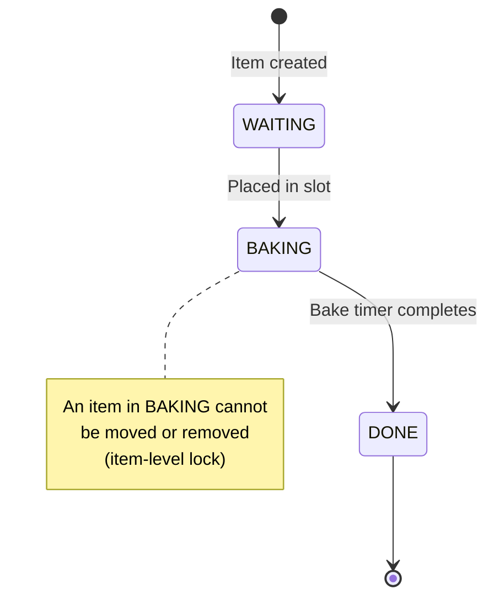

# Order State Machine

The lifecycle of an order from placement to delivery.

## State Transitions

| From | To | Trigger |
|------|----|---------| 
| `PENDING_PAYMENT` | `PAID` | Payment processed successfully |
| `PENDING_PAYMENT` | `PAYMENT_FAILED` | Payment processor returned failure |
| `PAYMENT_FAILED` | `PAID` | Retry succeeded |
| `PAID` | `QUEUED` | Items added to scheduler queue (immediate) |
| `QUEUED` | `BAKING` | First item placed in an oven slot |
| `BAKING` | `READY` | Last item finished baking |
| `READY` | `DELIVERED` | Customer pickup confirmed |

## Item State Machine

Items have a simpler lifecycle within an order:

## Invariants

- An order with state `BAKING` has at least one item in state `BAKING`
- An order with state `READY` has all items in state `DONE`
- Items in state `BAKING` cannot transition back to `WAITING` (item-level lock)
- The state machine rejects invalid transitions with `InvalidStateTransitionError`
- Items still in `WAITING` from an order with other items already `BAKING` can be reprioritized by an incoming VIP order
