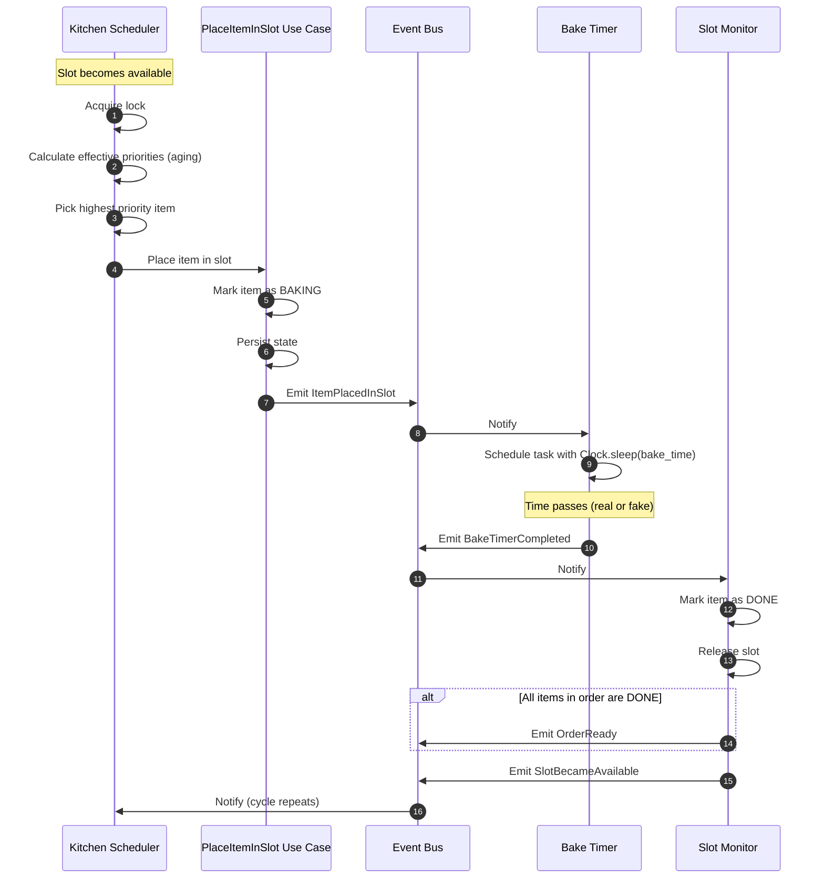

# Scheduler Event Flow

The kitchen scheduler operates through four cooperating components that communicate via the event bus. This diagram shows the cycle from item placement to completion.

## Component Responsibilities

- **Kitchen Scheduler:** Decides which item to bake next. Owns the priority queue and the single lock.
- **PlaceItemInSlot Use Case:** Performs the actual assignment, persists state, and emits the placement event.
- **Bake Timer:** Measures bake time and emits a completion event when time elapses.
- **Slot Monitor:** Detects completion, releases the slot, and triggers the next cycle.

## Why This Separation Matters

Each component has a single reason to change. The scheduler is independent of time measurement; the timer is independent of priority decisions; the monitor is independent of placement logic. This is the Single Responsibility Principle made concrete.

It also enables deterministic testing: by replacing the real clock with a fake clock and calling `process_pending_timers()`, tests can simulate the passage of any duration instantly.
